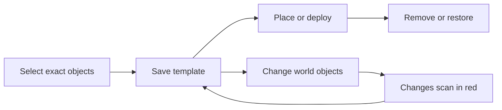

# DecoSwap quick guide

DecoSwap 0.1.3 is designed around four readable actions:



## First decoration

1. Run `/ds wand`.
2. Use `/ds mode object`.
3. Click each block and entity that belongs to the decoration. The blue Display wireframes are private to you.
4. Run `/ds save SpawnChristmas`.

The Anchor step is optional. New templates use the player's current position. Existing templates keep their original home position when updated.

`/ds save` never removes world objects. Use `/ds pack SpawnChristmas` only when the selected objects should be removed after the file is safely written.

## Region convenience selection

Use `/ds mode region`, then left click Position 1 and right click Position 2. Import the cuboid with one of:

```text
/ds select region all
/ds select region blocks
/ds select region entities
```

The imported content becomes an exact object list. It is safe to remove individual objects afterward.

## Place and restore

```text
/ds place SpawnChristmas
/ds remove SpawnChristmas
```

`place` creates a fresh pre-deployment snapshot before changing blocks. `remove` checks for conflicts, removes only entities spawned by that deployment, and restores the captured world state. The longer names `/ds deploy` and `/ds restore` remain available.

The same words work for Groups:

```text
/ds place Christmas2026
/ds remove Christmas2026
```

You can also use `/ds group deploy Christmas2026` and `/ds group restore Christmas2026`.

## Updating edits

After changing a saved block, armor stand, Display Entity, item frame, sign, or other decoration object, DecoSwap detects the affected home template automatically. Admins see red Display outlines and a localized chat report with the object name and coordinates. You can also request an immediate scan with:

```text
/ds changes SpawnChristmas
```

Changed blocks and found entities are outlined red for administrators. Missing entities are marked at their expected location and listed by type/name and coordinates, never by raw UUID. Select changed or missing objects with the wand, then run `/ds save SpawnChristmas` to update. Add `--force` when you intentionally want to confirm an overwrite: `/ds save SpawnChristmas --force`.

Saving an existing name updates the template and creates a backup when enabled. It does not remove anything from the world.

## Groups

```text
/ds group create Christmas2026
/ds group add Christmas2026 SpawnChristmas
/ds group add Christmas2026 MainStreetLights
/ds place Christmas2026
/ds remove Christmas2026
```

Group members retain their order. Group deployment is transactional where safe: if a member fails, already-applied members are rolled back and the failure is reported.

## In-game guide and advanced help

Run `/ds guide` or click Help in `/ds gui` to open the localized vanilla written-book guide. Minecraft written books cannot contain raster screenshots without a resource pack, so the guide uses clear pages and the GUI uses vanilla custom heads as visual icons.

For storage, permissions, recovery transactions, compatibility, and the complete manual test matrix, use the repository documents or the [DecoSwap wiki](https://github.com/MrDinoCarlos/DecoSwap/wiki).
