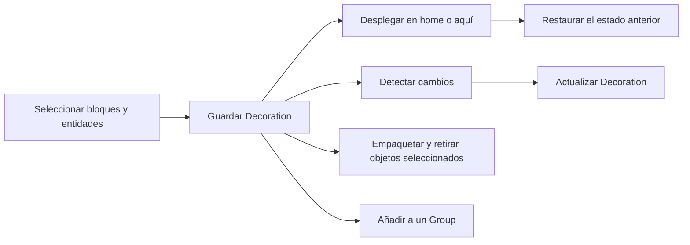

# DecoSwap — brief para generar una wiki estructurada

Este archivo está preparado para pasárselo a ChatGPT junto con el resto de la documentación del repositorio. Su objetivo es servir como contexto editorial y técnico para generar una wiki completa, coherente y dividida en páginas pequeñas.

## Prompt listo para pegar

Actúa como redactor técnico y arquitecto de documentación para un plugin de Minecraft Paper llamado **DecoSwap**. Usa este archivo y los documentos enlazados como fuente de verdad.

Genera una wiki en español, clara para administradores de servidores y creadores de decoraciones. Mantén los nombres de comandos, permisos, claves de configuración, nombres de archivos, nombres de clases y términos técnicos exactamente como aparecen en las fuentes.

La wiki debe seguir siempre esta jerarquía:

```text
Categoría principal
└── Subcategoría
    └── Artículo individual
```

Cada artículo individual debe explicar una sola función o concepto principal. Si una página empieza a explicar dos funciones independientes, divídela en dos artículos y enlázalos entre sí.

Para cada artículo incluye, cuando corresponda:

1. Título y ubicación dentro de la jerarquía.
2. `Short description`: una frase breve que pueda usarse como resumen de la página.
3. Descripción larga: dos o cuatro párrafos que expliquen qué hace la función, cuándo usarla y qué resultado produce.
4. Requisitos y permisos.
5. Sintaxis exacta del comando o configuración.
6. Tabla de argumentos, opciones o valores admitidos.
7. Procedimiento paso a paso.
8. Ejemplo real de uso.
9. Comportamiento esperado y límites.
10. Advertencias de seguridad, conflictos, pérdida de datos o compatibilidad.
11. Artículos relacionados.
12. Versión en la que existe o cambió la función, únicamente si consta en las fuentes.

Reglas editoriales:

- No inventes comandos, permisos, opciones, versiones, integraciones ni comportamientos.
- No presentes una inferencia del código como una función pública si no está respaldada por la documentación o por una implementación claramente expuesta.
- Si falta información, escribe `Pendiente de confirmar` y añade el dato a una sección final llamada `Información pendiente`.
- Distingue siempre entre `SAVE`, `PACK`, `PLACE/DEPLOY` y `REMOVE/RESTORE`.
- Explica que una Decoration es una lista exacta de bloques y entidades, no una selección aproximada ni un schematic.
- Explica que los artículos de comandos deben ser atómicos: un artículo para guardar, otro para empaquetar, otro para desplegar, otro para restaurar, etc.
- Usa bloques de código para comandos y YAML. No traduzcas las partes ejecutables.
- Incluye enlaces internos entre páginas relacionadas.
- Prioriza ejemplos prácticos y procedimientos seguros.
- Mantén una sección de changelog separada. No inventes cambios de versiones anteriores.
- Si el destino de la wiki no está especificado, entrega Markdown genérico, con una página índice y el contenido de cada artículo separado por un encabezado de nivel 1.

Entrega el resultado en este orden:

1. Datos generales del plugin.
2. Árbol completo de la wiki.
3. Índice de artículos con sus `short description`.
4. Contenido de todos los artículos.
5. Tabla de comandos.
6. Tabla de permisos.
7. Tabla de configuración.
8. Compatibilidad e integraciones.
9. Almacenamiento y recuperación.
10. Changelog verificado.
11. Información pendiente y preguntas para el autor.

## Datos generales reutilizables

### Identidad

- **Nombre:** DecoSwap
- **Versión documentada:** 0.1.3
- **Tipo:** plugin de Paper para Minecraft
- **Autor:** MrDinoCarlos
- **Web:** https://mrdino.es/
- **GitHub:** https://github.com/MrDinoCarlos
- **Wiki pública indicada por el proyecto:** https://github.com/MrDinoCarlos/DecoSwap/wiki
- **Licencia:** PolyForm Noncommercial License 1.0.0; permite uso, estudio, modificación y distribución para fines no comerciales, pero no permite uso comercial
- **Comando principal:** `/decoswap`
- **Alias corto:** `/ds`
- **Dependencia opcional:** EasyArmorStands
- **Resource pack obligatorio:** no
- **WorldEdit, FAWE, ProtocolLib, WorldGuard y plugins de schematics:** no son necesarios ni se usan en 0.1.3

### Short description recomendada

> DecoSwap permite capturar bloques y entidades exactos como decoraciones reutilizables, organizarlas en grupos y desplegarlas con snapshots y restauración segura.

### Long description recomendada

> DecoSwap es un plugin de Paper para crear decoraciones reutilizables a partir de una selección exacta de bloques y entidades. Una Decoration conserva posiciones relativas, estados de bloques, propiedades compatibles de entidades, inventarios permitidos, PDC y otros datos semánticos para poder guardarla, actualizarla, empaquetarla, desplegarla y restaurarla.
>
> El plugin ofrece selección individual por objeto y selección por región, un Anchor opcional, grupos ordenados de Decorations, detección de cambios, una GUI localizada y un libro de ayuda dentro del juego. Cada despliegue captura primero el estado actual del mundo en un snapshot, comprueba conflictos durante la restauración y conserva datos de recuperación cuando una operación queda incompleta.
>
> DecoSwap está orientado a administradores y constructores que necesitan reutilizar decoraciones en distintas ubicaciones o temporadas sin depender de un schematic completo. Las operaciones destructivas están separadas de las operaciones de guardado y requieren permisos administrativos.

### Resumen funcional

El flujo principal del plugin es:



## Árbol recomendado de la wiki

Usa este árbol como estructura principal. Los nombres son sugerencias de páginas y pueden adaptarse al formato de la plataforma, pero debe conservarse la separación por función.

### 1. Introducción

- ¿Qué es DecoSwap?
- Conceptos principales: Decoration, Group, Anchor, Deployment y Snapshot
- Flujo de trabajo recomendado
- Casos de uso
- Limitaciones conocidas

### 2. Instalación y actualización

- Requisitos del servidor
- Instalación del archivo JAR
- Primer arranque
- Actualización entre versiones
- Copias de seguridad antes de actualizar
- Comprobación de instalación con `/ds version`

### 3. Primeros pasos

- Obtener la herramienta con `/ds wand`
- Modos `object`, `region` y `anchor`
- Selección individual de objetos
- Selección por región
- Consultar la selección
- Limpiar la selección
- Deshacer una edición de selección
- Establecer y consultar un Anchor

### 4. Decorations

- Guardar una Decoration con `/ds save`
- Actualizar una Decoration existente
- Diferencia entre guardar y empaquetar
- Empaquetar con `/ds pack`
- Mantener los objetos del mundo con `--keep-world`
- Consultar una Decoration
- Listar Decorations
- Eliminar una Decoration
- Nombres válidos y normalización de IDs

### 5. Selección avanzada

- Importar bloques de una región
- Importar entidades de una región
- Importar bloques y entidades
- Invertir los bloques de una región
- Filtrar por material
- Filtrar por tipo de entidad
- Mantener solo bloques
- Mantener solo entidades
- Límites de selección
- Objetos excluidos de la captura

### 6. Despliegue y restauración

- Desplegar con `/ds place`
- Desplegar con `/ds deploy`
- Desplegar en la posición original (`home`)
- Desplegar en la posición del jugador (`here`)
- Rotaciones de 0, 90, 180 y 270 grados
- Restaurar con `/ds remove`
- Restaurar con `/ds restore`
- Instancias activas y `/ds active`
- Consultar el estado con `/ds status`
- Conflictos durante la restauración
- Uso excepcional de `--force`
- Despliegues duplicados y solapamientos

### 7. Detección y actualización de cambios

- Detección automática de cambios
- Escaneo manual con `/ds changes`
- Contornos rojos para administradores
- Objetos modificados
- Entidades desaparecidas
- Aceptar cambios con `/ds save`
- Confirmar una sobrescritura con `--force`

### 8. Groups

- Crear un Group
- Añadir una Decoration
- Quitar una Decoration
- Orden de los miembros
- Consultar y listar Groups
- Desplegar un Group
- Restaurar un Group
- Rollback de un Group cuando falla un miembro
- Iconos de Groups en la GUI

### 9. GUI, idioma y guía dentro del juego

- Abrir `/ds gui`
- Menú de Decorations
- Menú de Groups
- Menú de despliegues activos
- Paginación
- Selector de iconos de Groups
- Texturas personalizadas de Mojang
- Abrir `/ds guide` o `/ds book`
- Idioma automático
- Cambiar el idioma con `/ds language`
- Archivos de traducción

### 10. Permisos

- Permiso base
- Herramienta y selección
- Guardado, actualización y borrado
- Empaquetado
- Despliegue y restauración
- Captura de inventarios
- Datos peligrosos
- Recuperación
- Recarga
- Permiso global `decoswap.admin`

### 11. Configuración

- Archivo `config.yml`
- Fusión automática de configuración
- Idioma
- Límites de selección
- Visuales temporales
- Presupuestos por tick
- Snapshots y política de conflictos
- Despliegues solapados y duplicados
- Grupos y rollback
- Captura de entidades y bloques
- Datos peligrosos
- Backups
- EasyArmorStands y logging

### 12. Seguridad, snapshots y recuperación

- Cómo funciona un Deployment
- Snapshot previo al despliegue
- Detección semántica de conflictos
- Políticas `ABORT`, `WARN_AND_SKIP` y `FORCE`
- Journal transaccional
- Operaciones interrumpidas y reinicio del servidor
- `/ds recovery list`
- Inspeccionar una recuperación
- Hacer rollback de una recuperación
- Aceptar el estado actual
- Backups de Decorations

### 13. Almacenamiento

- Directorios creados por DecoSwap
- Formato de Decorations
- Formato de Snapshots
- Archivos de transacciones
- Grupos y `groups.yml`
- Migraciones de esquema
- Archivos `.defaults.yml`
- Archivos inválidos o de una versión más nueva
- Retención de backups

### 14. Compatibilidad e integraciones

- Paper 1.21.4
- Paper 1.21.x posterior
- Paper 26.1.x, 26.2.x y 26.3
- Java 21
- EasyArmorStands 2.x y 3.x
- Datos conservados de Armor Stands
- Datos conservados de Display Entities
- Comportamiento cuando una versión no está certificada
- Plugins que no son necesarios

### 15. API para desarrolladores

- Obtener la instancia de `DecoSwapAPI`
- Buscar una Decoration
- Listar Decorations
- Buscar un Group
- Listar Groups
- Desplegar una Decoration desde Java
- Restaurar un Deployment desde Java
- Consultar si una Decoration está activa
- Consultar Deployments activos
- Eventos de Decorations
- Eventos de Groups
- Consideraciones sobre operaciones asíncronas

### 16. Solución de problemas

- La herramienta no responde
- La selección no contiene objetos
- Una Decoration no aparece
- Un despliegue se rechaza por conflicto
- La restauración se aborta
- Una entidad falta al restaurar
- El servidor se reinició durante una operación
- No aparecen los visuales
- Problemas con idiomas
- Problemas con iconos personalizados
- Error de compatibilidad
- Recuperación de archivos dañados

### 17. Changelog

- Changelog de 0.1.3
- Plantilla para futuras versiones
- Cambios incompatibles
- Migraciones de datos
- Cambios de permisos y configuración

## Ficha obligatoria para cada artículo

Usa esta plantilla para cada página individual. El campo `Función única` obliga a mantener los artículos atómicos.

```markdown
# <Título del artículo>

- **Categoría:** <categoría principal>
- **Subcategoría:** <subcategoría>
- **Función única:** <una sola función o concepto>
- **Slug sugerido:** <slug>
- **Versión:** <versión verificada o “Pendiente de confirmar”>

## Short description

<Una frase de máximo dos líneas.>

## Descripción

<Explicación larga: qué hace, cuándo se usa y cuál es el resultado.>

## Requisitos y permisos

<Requisitos, permisos y configuración relacionada.>

## Sintaxis

```text
<comando o formato exacto>
```

## Argumentos y opciones

| Elemento | Valores | Descripción |
|---|---|---|
| ... | ... | ... |

## Procedimiento

1. <Paso 1>
2. <Paso 2>
3. <Paso 3>

## Ejemplo

```text
<ejemplo>
```

## Comportamiento y límites

<Qué conserva, qué modifica, qué ignora y qué ocurre en casos límite.>

## Advertencias

<Riesgos, conflictos, backups o permisos elevados.>

## Artículos relacionados

- [<Artículo relacionado>](<enlace interno>)
```

Para artículos de configuración, sustituye `Sintaxis` por una ruta YAML exacta y añade valor por defecto, tipo, rango y efecto de reiniciar o recargar. Para artículos de API, añade firma Java, resultado, errores y ejemplo mínimo. Para artículos de troubleshooting, añade síntomas, causa probable, comprobaciones y solución.

## Inventario verificado de comandos

Los comandos siguientes deben aparecer en la wiki. Las páginas de comandos deben explicar una acción por página cuando sea razonable.

| Comando | Función |
|---|---|
| `/ds help` | Mostrar ayuda localizada. |
| `/ds gui` | Abrir la GUI de administración. |
| `/ds reload` | Recargar configuración, idiomas, integraciones y visuales. |
| `/ds wand` | Entregar la herramienta de selección identificada por PDC. |
| `/ds mode <object\|region\|anchor>` | Cambiar el modo de selección. |
| `/ds select info` | Mostrar cantidades exactas seleccionadas. |
| `/ds select clear` | Limpiar bloques y entidades seleccionados. |
| `/ds select region [blocks\|entities\|all]` | Importar el cubo actual en la selección exacta. |
| `/ds select blocks` | Conservar solo bloques. |
| `/ds select entities` | Conservar solo entidades. |
| `/ds select invert` | Invertir los bloques no aire de la región actual. |
| `/ds select remove <type>` | Quitar un material o `EntityType`. |
| `/ds undo` | Deshacer una edición reciente de selección. |
| `/ds anchor set` | Establecer el Anchor en la posición del jugador. |
| `/ds anchor info` | Consultar el Anchor actual. |
| `/ds anchor clear` | Ocultar y limpiar el Anchor. |
| `/ds save <name> [--force]` | Guardar o actualizar una Decoration sin retirar objetos. |
| `/ds update <name>` | Alias explícito para actualizar una Decoration. |
| `/ds pack <name> [--keep-world]` | Guardar o actualizar y retirar los objetos exactos, salvo que se conserve el mundo. |
| `/ds changes <name>` | Escanear una Decoration y mostrar cambios. |
| `/ds deploy <name> [home\|here] [--rotation 0\|90\|180\|270]` | Desplegar una Decoration o Group. |
| `/ds place <name>` | Alias simple de deploy. |
| `/ds restore <name> [deployment-id] [--force]` | Restaurar un despliegue. |
| `/ds remove <name>` | Alias simple de restore. |
| `/ds group create <name>` | Crear un Group. |
| `/ds group delete <name>` | Eliminar un Group. |
| `/ds group add <group> <decoration>` | Añadir una Decoration en orden. |
| `/ds group remove <group> <decoration>` | Quitar una Decoration. |
| `/ds group info <name>` | Consultar un Group. |
| `/ds group list` | Listar Groups. |
| `/ds group deploy <name>` | Desplegar un Group. |
| `/ds group restore <name>` | Restaurar un Group. |
| `/ds group enable <name>` | Alias de deploy de Group. |
| `/ds group disable <name>` | Alias de restore de Group. |
| `/ds active` | Listar Deployments activos. |
| `/ds status <decoration>` | Mostrar el número de instancias activas. |
| `/ds recovery list` | Listar transacciones incompletas. |
| `/ds recovery inspect <id>` | Inspeccionar una recuperación. |
| `/ds recovery rollback <id>` | Restaurar el snapshot retenido. |
| `/ds recovery accept <id>` | Aceptar el mundo actual y archivar la recuperación. |
| `/ds language <auto\|en_US\|es_ES>` | Establecer la preferencia de idioma. |
| `/ds version` | Mostrar servidor, adaptador, integración y esquema. |
| `/ds guide` | Abrir la guía localizada dentro del juego. |

`/decoswap` es equivalente a `/ds`. También existen formas antiguas bajo `/ds decoration ...`; deben documentarse como aliases de compatibilidad, no como la interfaz recomendada.

## Permisos verificados

Todos los permisos listados tienen valor predeterminado de operador. `decoswap.admin` incluye todos los permisos de DecoSwap.

| Permiso | Función |
|---|---|
| `decoswap.use` | Acceso base al comando. |
| `decoswap.help` | Ayuda. |
| `decoswap.wand` | Herramienta. |
| `decoswap.select` | Selección. |
| `decoswap.anchor` | Anchor. |
| `decoswap.decoration.create` | Política reservada de creación. |
| `decoswap.decoration.save` | Nuevos guardados. |
| `decoswap.decoration.update` | Sobrescritura de plantillas. |
| `decoswap.decoration.delete` | Borrado. |
| `decoswap.decoration.pack` | Guardado/actualización y retirada exacta. |
| `decoswap.decoration.deploy` | Despliegue. |
| `decoswap.decoration.restore` | Restauración segura. |
| `decoswap.decoration.info` | Listados, información y estado. |
| `decoswap.decoration.changes` | Comparación y visualización de cambios. |
| `decoswap.group.create` | Crear Groups. |
| `decoswap.group.edit` | Editar miembros. |
| `decoswap.group.delete` | Eliminar Groups. |
| `decoswap.group.deploy` | Operaciones de mundo de Groups. |
| `decoswap.group.restore` | Restauración de Groups. |
| `decoswap.capture.inventory` | Capturar inventarios y objetos. |
| `decoswap.capture.commandblock` | Política reservada de command blocks. |
| `decoswap.capture.dangerous` | Política reservada de datos peligrosos. |
| `decoswap.deploy.force` | Forzar solapamientos explícitos. |
| `decoswap.restore.force` | Restaurar sobrescribiendo conflictos. |
| `decoswap.recovery` | Inspeccionar y actuar sobre recuperaciones. |
| `decoswap.reload` | Recargar configuración. |
| `decoswap.admin` | Todos los permisos anteriores. |

Los datos peligrosos también dependen de la configuración global. La captura de inventarios requiere siempre `decoswap.capture.inventory`.

## Configuración verificada

El archivo es `plugins/DecoSwap/config.yml`. Los valores indicados son los valores documentados en 0.1.3.

| Ruta | Valor por defecto | Efecto |
|---|---:|---|
| `language.default` | `en_US` | Idioma predeterminado. |
| `language.fallback` | `en_US` | Idioma de reserva. |
| `language.auto-detect-client-locale` | `true` | Detecta el idioma del cliente. |
| `selection.selector-material` | `BLAZE_ROD` | Material de la herramienta. |
| `selection.max-region-volume` | `1000000` | Volumen máximo importable. |
| `selection.max-blocks` | `500000` | Máximo de bloques seleccionados. |
| `selection.max-entities` | `10000` | Máximo de entidades seleccionadas. |
| `visuals.enabled` | `true` | Activa visuales temporales. |
| `visuals.block-outline-limit` | `200` | Límite de contornos individuales de bloques. |
| `visuals.entity-outline-limit` | `200` | Límite de contornos individuales de entidades. |
| `visuals.detail-radius` | `48` | Radio de detalle visual. |
| `visuals.region-outline` | `true` | Muestra contorno de región. |
| `visuals.anchor-gizmo` | `true` | Muestra el gizmo del Anchor. |
| `visuals.labels` | `true` | Muestra etiquetas visuales. |
| `operations.blocks-per-tick` | `2500` | Presupuesto de bloques por tick. |
| `operations.entities-per-tick` | `100` | Presupuesto de entidades por tick. |
| `operations.save-async` | `true` | Permite guardado asíncrono. |
| `snapshots.archive-completed` | `true` | Archiva snapshots terminados. |
| `conflicts.restore-policy` | `ABORT` | Política predeterminada de conflictos. |
| `deployments.allow-overlap` | `false` | Permite solapamiento de despliegues. |
| `deployments.allow-duplicate-home` | `false` | Permite duplicar el home. |
| `groups.rollback-on-failure` | `true` | Revierte miembros previos si falla un Group. |
| `entities.capture-non-persistent` | `false` | Captura entidades no persistentes. |
| `entities.capture-scoreboard-tags` | `true` | Conserva scoreboard tags. |
| `blocks.capture-inventories` | `true` | Permite capturar inventarios, sujeto a permiso. |
| `blocks.capture-pdc` | `true` | Conserva PDC de bloques compatibles. |
| `dangerous-data.command-blocks` | `false` | Captura command blocks. |
| `dangerous-data.structure-blocks` | `false` | Captura structure blocks. |
| `dangerous-data.spawners` | `true` | Captura spawners. |
| `backups.enabled` | `true` | Activa backups automáticos. |
| `backups.keep` | `10` | Número de backups conservados. |
| `backups.before-update` | `true` | Backup antes de actualizar. |
| `backups.before-delete` | `true` | Backup antes de borrar. |
| `backups.before-migration` | `true` | Backup antes de migrar. |
| `integrations.easyarmorstands` | `true` | Activa detección de EasyArmorStands. |
| `logging.verbose` | `false` | Activa logging detallado. |
| `sounds.enabled` | `true` | Activa sonidos del plugin. |

Durante el arranque y `/ds reload`, los valores nuevos se fusionan automáticamente. Los valores modificados por el administrador se conservan y se crea una copia fechada antes de la fusión.

## Hechos técnicos que deben explicarse

### Selección y visuales

- Las selecciones son conjuntos de coordenadas exactas de bloques y UUID de entidades.
- La selección por región se importa a esa misma lista exacta; después se pueden quitar objetos individuales.
- Los jugadores y las entidades visuales propias de DecoSwap no se capturan.
- Las entidades no persistentes se excluyen por defecto.
- Los visuales son `BlockDisplay` y `TextDisplay` temporales, etiquetados con PDC y visibles solo para el propietario.
- Los visuales se limpian al borrar la selección, salir, cambiar de mundo, desactivar el plugin y arrancar limpiando huérfanos.
- DecoSwap no usa partículas.
- Las selecciones pequeñas reciben contornos por objeto; las grandes usan un contorno agregado.

### Decorations

- Una Decoration almacena objetos exactos con coordenadas relativas a su Anchor.
- Si se guarda una Decoration nueva sin Anchor, se usa la posición actual del jugador.
- Al actualizar una Decoration existente, se conserva su Anchor original salvo que se establezca otro explícitamente.
- `save` no elimina objetos del mundo.
- `pack` escribe primero la plantilla y después puede retirar los objetos exactos seleccionados.
- El primer `pack` no puede reconstruir permanentemente un bloque que ya había sido reemplazado antes de que DecoSwap comenzara a rastrear la posición.

### Despliegue y restauración

- `place` y `deploy` son aliases funcionales.
- Antes de cambiar bloques, un despliegue captura el estado actual en un snapshot.
- La restauración valida el estado desplegado mediante fingerprints semánticos.
- La política predeterminada `ABORT` conserva los datos del mundo cuando detecta cambios.
- `WARN_AND_SKIP` omite conflictos y `FORCE` permite sobrescribirlos cuando la configuración y los permisos lo permiten.
- La restauración elimina las entidades creadas por ese despliegue usando sus UUID registrados y no entidades cercanas ajenas.
- Los solapamientos y homes duplicados se rechazan por defecto.
- Los despliegues interrumpidos sobreviven al reinicio y aparecen en `/ds recovery`.

### Groups

- Un Group contiene Decorations en un orden determinista.
- Los Groups también se pueden desplegar y restaurar con las operaciones simplificadas `place` y `remove`.
- Si falla un miembro y `groups.rollback-on-failure` está activo, se intenta revertir lo aplicado previamente.
- Los iconos de Groups usan cabezas vanilla y una textura válida de `textures.minecraft.net`; no requieren resource pack.

### Compatibilidad

- El proyecto compila contra Paper 1.21.4 y Java 21.
- El rango objetivo indicado es Paper 1.21.4, versiones posteriores de 1.21.x y Paper 26.1.x, 26.2.x y 26.3.
- Las versiones posteriores deben considerarse compatibles pendientes de verificar con la matriz manual.
- EasyArmorStands es una dependencia blanda. Se detectan ramas 2.x y 3.x sin enlazar directamente sus clases.
- Se conservan estado y propiedades compatibles de Armor Stands, Display Entities, entidades colgantes, vehículos, inventarios permitidos, PDC y scoreboard tags según la implementación.

## Almacenamiento que debe documentarse

Ruta raíz: `plugins/DecoSwap/`.

```text
config.yml
groups.yml
players.yml
lang/en_US.yml
lang/es_ES.yml
config.yml.defaults.yml
lang/en_US.yml.defaults.yml
lang/es_ES.yml.defaults.yml
decorations/<safe-id>/meta.yml
decorations/<safe-id>/data.dswap
snapshots/<deployment-uuid>.dsnap
transactions/<deployment-uuid>.yml
transactions/<deployment-uuid>.expected
transactions/archive/
backups/
```

El contenido grande usa un formato binario GZIP versionado y acotado. `DSWP` identifica payloads de Decorations y `DSNP` identifica snapshots y estados esperados. Metadata y transacciones permanecen en YAML. Las escrituras usan archivos temporales en el mismo directorio y reemplazo atómico cuando el sistema de archivos lo permite.

No se deben borrar manualmente archivos de `transactions/` mientras exista una operación incompleta. Los datos con un esquema más nuevo se rechazan sin sobrescribirlos; los archivos inválidos permanecen en su sitio y se informa del problema.

## API pública que se puede incluir

La API Java pública expone `es.mrdino.decoswap.api.DecoSwapAPI` con estas operaciones:

```java
Optional<Decoration> getDecoration(String name);
Collection<Decoration> getDecorations();
Optional<DecorationGroup> getGroup(String name);
Collection<DecorationGroup> getGroups();
CompletableFuture<Deployment> deployDecoration(
    Decoration decoration, Anchor target, Rotation rotation, Player actor);
CompletableFuture<DeploymentEngine.RestoreResult> restoreDeployment(
    UUID deploymentId, Player actor, boolean force);
boolean isDecorationActive(UUID decorationId);
Collection<Deployment> getActiveDeployments();
```

La documentación para desarrolladores debe explicar que las operaciones de despliegue y restauración devuelven `CompletableFuture`, que restaurar requiere un UUID de deployment activo y que el uso de `force` debe reservarse para integraciones administrativas autorizadas.

Eventos públicos disponibles en el paquete `es.mrdino.decoswap.api.event`:

- `DecorationPreDeployEvent`
- `DecorationDeployEvent`
- `DecorationPreRestoreEvent`
- `DecorationRestoreEvent`
- `DecorationPackEvent`
- `DecorationSaveEvent`
- `GroupDeployEvent`
- `GroupRestoreEvent`

## Changelog verificado

El repositorio contiene documentación y configuración para la versión `0.1.3`, pero no contiene un historial de versiones separado ni notas verificadas para versiones anteriores. Por tanto, la wiki debe empezar con una entrada prudente:

### 0.1.3

- Versión documentada del plugin.
- Incluye selección exacta de bloques y entidades.
- Incluye Decorations, Groups, Anchor, despliegue, restauración y snapshots.
- Incluye detección de cambios con visuales rojos para administradores.
- Incluye GUI localizada, libro de guía y soporte `en_US`/`es_ES`.
- Incluye recuperación de transacciones incompletas y backups automáticos.
- Incluye integración opcional con EasyArmorStands.
- Compatibilidad objetivo: Paper 1.21.4, versiones posteriores de 1.21.x y Paper 26.1.x–26.3, pendiente de certificación individual.

No afirmes que estos puntos son una lista exhaustiva de cambios de la versión si no aparece un changelog oficial. Para futuras versiones usa esta plantilla:

```markdown
## <versión> — <fecha>

### Añadido
- <cambio verificado>

### Modificado
- <cambio verificado>

### Corregido
- <problema verificado>

### Compatibilidad y migración
- <cambio de servidor, Java, esquema, permiso o configuración>
```

## Fuentes de verdad del repositorio

Usa cada documento para el tema indicado y avisa si dos fuentes entran en conflicto.

| Fuente | Contenido principal |
|---|---|
| `README.md` | Resumen, requisitos, flujo básico, seguridad y limitaciones. |
| `GUIDE.md` | Guía rápida de uso dentro del juego. |
| `COMMANDS.md` | Inventario de comandos, aliases y GUI. |
| `PERMISSIONS.md` | Permisos y condiciones de captura. |
| `COMPATIBILITY.md` | Versiones Paper, Java e EasyArmorStands. |
| `STORAGE.md` | Archivos, formatos, migraciones y backups. |
| `MANUAL_TESTING.md` | Comportamiento verificable y matriz manual. |
| `src/main/resources/plugin.yml` | Nombre, versión expandida, comando, dependencia y permisos registrados. |
| `src/main/resources/config.yml` | Valores de configuración de 0.1.3. |
| `src/main/resources/lang/es_ES.yml` | Mensajes y términos en español. |
| `src/main/resources/lang/en_US.yml` | Mensajes y términos en inglés. |
| `src/main/java/.../DecoSwapCommand.java` | Rutas de ejecución, aliases y validaciones de comandos. |
| `src/main/java/.../api/DecoSwapAPI.java` | API pública y firmas disponibles. |
| `build.gradle.kts` | Versión, Java 21 y dependencia de Paper API usada para compilar. |

## Información pendiente para el autor

Antes de publicar una wiki definitiva, pregunta o marca como pendiente lo siguiente si no aparece en nuevas fuentes:

- Versión exacta de Minecraft y Paper que se desea anunciar como oficialmente soportada.
- Fecha de publicación de 0.1.3.
- Historial real de cambios de 0.1.0, 0.1.1 y 0.1.2, si esas versiones existieron.
- Si la wiki final se publicará en GitHub Wiki, documentación web, Notion u otra plataforma.
- Capturas de pantalla o GIFs que el autor quiera añadir.
- Permisos concretos recomendados para moderadores frente a administradores.
- Lista completa de tipos de bloques y entidades cuyo estado está certificado mediante pruebas reales.
- Política recomendada para plugins de protección de regiones, ya que los hooks específicos están fuera de 0.1.3.
- Procedimiento oficial de instalación del servidor que acompañará al JAR.
